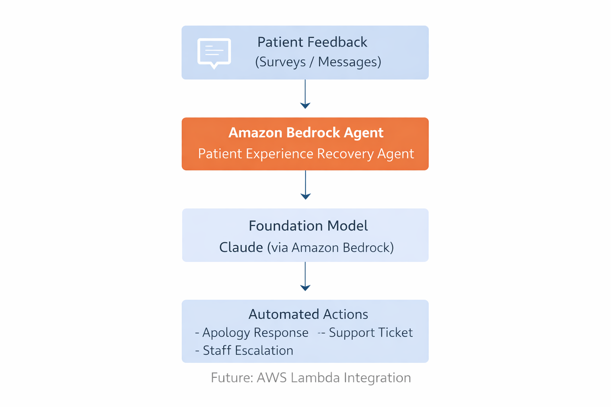

# Patient Experience Analytics & Automated Service Recovery Agent

## Overview
This project presents an Agentic AI solution built using Amazon Bedrock that analyzes patient feedback, determines issue severity, and autonomously triggers appropriate service recovery actions. The goal is to transform passive patient complaints into real-time, actionable operational improvements for hospitals.

## Problem Statement
Hospitals receive large volumes of patient feedback through surveys and messages. This feedback is often reviewed manually and too late to take corrective action. As a result, patient dissatisfaction remains unresolved and service quality issues repeat.

## Solution
We built an AI-powered agent using Amazon Bedrock that:
- Understands patient feedback in natural language
- Identifies the issue category
- Classifies severity as LOW, MEDIUM, or HIGH
- Decides and executes the appropriate recovery action automatically

## How the Agent Works
1. Patient submits feedback text
2. The Bedrock Agent analyzes the feedback
3. Issue category and severity are identified
4. The agent decides the action:
   - LOW: Polite apology and reassurance
   - MEDIUM: Internal support ticket creation
   - HIGH: Immediate escalation to hospital staff

## Agentic AI Characteristics
- Autonomous decision-making
- Reasoning over unstructured text
- Action-oriented responses
- Designed with human-in-the-loop escalation for critical cases

## Technology Stack
- Amazon Bedrock
- Amazon Bedrock Agents
- Anthropic Claude Foundation Model
- AWS IAM

  ## Architecture Diagram

## Demo
A live demonstration of the working agent is provided via a recorded video showing the agent analyzing patient feedback and triggering recovery actions.

## Future Enhancements
- Integration with AWS Lambda for real ticket creation and notifications
- Admin dashboards for hospital management insights
- Memory to detect repeat complaints and systemic issues
- Multilingual support for inclusive patient feedback handling

## Conclusion
This project demonstrates how Agentic AI can be applied to healthcare operations to improve patient experience through real-time analysis and automated service recovery workflows.
